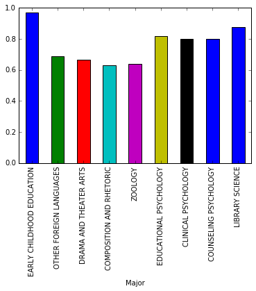

# Data Visualization in Python

For this project, I will be using Python to visualize FiveThirtyEight [data](https://github.com/fivethirtyeight/data/tree/master/college-majors) regarding the job outcomes of students who graduated from college between 2010 and 2012. 


```python
import pandas as pd
import matplotlib.pyplot as plt
% matplotlib inline
```


```python
recent_grads = pd.read_csv('recent-grads.csv')
recent_grads.iloc[0]
```


    Rank                                        1
    Major_code                               2419
    Major                   PETROLEUM ENGINEERING
    Total                                    2339
    Men                                      2057
    Women                                     282
    Major_category                    Engineering
    ShareWomen                           0.120564
    Sample_size                                36
    Employed                                 1976
    Full_time                                1849
    Part_time                                 270
    Full_time_year_round                     1207
    Unemployed                                 37
    Unemployment_rate                   0.0183805
    Median                                 110000
    P25th                                   95000
    P75th                                  125000
    College_jobs                             1534
    Non_college_jobs                          364
    Low_wage_jobs                             193
    Name: 0, dtype: object


```python
recent_grads.head()
```


<div>
<style scoped>
    .dataframe tbody tr th:only-of-type {
        vertical-align: middle;
    }

    .dataframe tbody tr th {
        vertical-align: top;
    }

    .dataframe thead th {
        text-align: right;
    }
</style>
<table border="1" class="dataframe">
  <thead>
    <tr style="text-align: right;">
      <th></th>
      <th>Rank</th>
      <th>Major_code</th>
      <th>Major</th>
      <th>Total</th>
      <th>Men</th>
      <th>Women</th>
      <th>Major_category</th>
      <th>ShareWomen</th>
      <th>Sample_size</th>
      <th>Employed</th>
      <th>...</th>
      <th>Part_time</th>
      <th>Full_time_year_round</th>
      <th>Unemployed</th>
      <th>Unemployment_rate</th>
      <th>Median</th>
      <th>P25th</th>
      <th>P75th</th>
      <th>College_jobs</th>
      <th>Non_college_jobs</th>
      <th>Low_wage_jobs</th>
    </tr>
  </thead>
  <tbody>
    <tr>
      <th>0</th>
      <td>1</td>
      <td>2419</td>
      <td>PETROLEUM ENGINEERING</td>
      <td>2339.0</td>
      <td>2057.0</td>
      <td>282.0</td>
      <td>Engineering</td>
      <td>0.120564</td>
      <td>36</td>
      <td>1976</td>
      <td>...</td>
      <td>270</td>
      <td>1207</td>
      <td>37</td>
      <td>0.018381</td>
      <td>110000</td>
      <td>95000</td>
      <td>125000</td>
      <td>1534</td>
      <td>364</td>
      <td>193</td>
    </tr>
    <tr>
      <th>1</th>
      <td>2</td>
      <td>2416</td>
      <td>MINING AND MINERAL ENGINEERING</td>
      <td>756.0</td>
      <td>679.0</td>
      <td>77.0</td>
      <td>Engineering</td>
      <td>0.101852</td>
      <td>7</td>
      <td>640</td>
      <td>...</td>
      <td>170</td>
      <td>388</td>
      <td>85</td>
      <td>0.117241</td>
      <td>75000</td>
      <td>55000</td>
      <td>90000</td>
      <td>350</td>
      <td>257</td>
      <td>50</td>
    </tr>
    <tr>
      <th>2</th>
      <td>3</td>
      <td>2415</td>
      <td>METALLURGICAL ENGINEERING</td>
      <td>856.0</td>
      <td>725.0</td>
      <td>131.0</td>
      <td>Engineering</td>
      <td>0.153037</td>
      <td>3</td>
      <td>648</td>
      <td>...</td>
      <td>133</td>
      <td>340</td>
      <td>16</td>
      <td>0.024096</td>
      <td>73000</td>
      <td>50000</td>
      <td>105000</td>
      <td>456</td>
      <td>176</td>
      <td>0</td>
    </tr>
    <tr>
      <th>3</th>
      <td>4</td>
      <td>2417</td>
      <td>NAVAL ARCHITECTURE AND MARINE ENGINEERING</td>
      <td>1258.0</td>
      <td>1123.0</td>
      <td>135.0</td>
      <td>Engineering</td>
      <td>0.107313</td>
      <td>16</td>
      <td>758</td>
      <td>...</td>
      <td>150</td>
      <td>692</td>
      <td>40</td>
      <td>0.050125</td>
      <td>70000</td>
      <td>43000</td>
      <td>80000</td>
      <td>529</td>
      <td>102</td>
      <td>0</td>
    </tr>
    <tr>
      <th>4</th>
      <td>5</td>
      <td>2405</td>
      <td>CHEMICAL ENGINEERING</td>
      <td>32260.0</td>
      <td>21239.0</td>
      <td>11021.0</td>
      <td>Engineering</td>
      <td>0.341631</td>
      <td>289</td>
      <td>25694</td>
      <td>...</td>
      <td>5180</td>
      <td>16697</td>
      <td>1672</td>
      <td>0.061098</td>
      <td>65000</td>
      <td>50000</td>
      <td>75000</td>
      <td>18314</td>
      <td>4440</td>
      <td>972</td>
    </tr>
  </tbody>
</table>
<p>5 rows × 21 columns</p>
</div>


```python
recent_grads.tail()
```


<div>
<style scoped>
    .dataframe tbody tr th:only-of-type {
        vertical-align: middle;
    }

    .dataframe tbody tr th {
        vertical-align: top;
    }

    .dataframe thead th {
        text-align: right;
    }
</style>
<table border="1" class="dataframe">
  <thead>
    <tr style="text-align: right;">
      <th></th>
      <th>Rank</th>
      <th>Major_code</th>
      <th>Major</th>
      <th>Total</th>
      <th>Men</th>
      <th>Women</th>
      <th>Major_category</th>
      <th>ShareWomen</th>
      <th>Sample_size</th>
      <th>Employed</th>
      <th>...</th>
      <th>Part_time</th>
      <th>Full_time_year_round</th>
      <th>Unemployed</th>
      <th>Unemployment_rate</th>
      <th>Median</th>
      <th>P25th</th>
      <th>P75th</th>
      <th>College_jobs</th>
      <th>Non_college_jobs</th>
      <th>Low_wage_jobs</th>
    </tr>
  </thead>
  <tbody>
    <tr>
      <th>168</th>
      <td>169</td>
      <td>3609</td>
      <td>ZOOLOGY</td>
      <td>8409.0</td>
      <td>3050.0</td>
      <td>5359.0</td>
      <td>Biology &amp; Life Science</td>
      <td>0.637293</td>
      <td>47</td>
      <td>6259</td>
      <td>...</td>
      <td>2190</td>
      <td>3602</td>
      <td>304</td>
      <td>0.046320</td>
      <td>26000</td>
      <td>20000</td>
      <td>39000</td>
      <td>2771</td>
      <td>2947</td>
      <td>743</td>
    </tr>
    <tr>
      <th>169</th>
      <td>170</td>
      <td>5201</td>
      <td>EDUCATIONAL PSYCHOLOGY</td>
      <td>2854.0</td>
      <td>522.0</td>
      <td>2332.0</td>
      <td>Psychology &amp; Social Work</td>
      <td>0.817099</td>
      <td>7</td>
      <td>2125</td>
      <td>...</td>
      <td>572</td>
      <td>1211</td>
      <td>148</td>
      <td>0.065112</td>
      <td>25000</td>
      <td>24000</td>
      <td>34000</td>
      <td>1488</td>
      <td>615</td>
      <td>82</td>
    </tr>
    <tr>
      <th>170</th>
      <td>171</td>
      <td>5202</td>
      <td>CLINICAL PSYCHOLOGY</td>
      <td>2838.0</td>
      <td>568.0</td>
      <td>2270.0</td>
      <td>Psychology &amp; Social Work</td>
      <td>0.799859</td>
      <td>13</td>
      <td>2101</td>
      <td>...</td>
      <td>648</td>
      <td>1293</td>
      <td>368</td>
      <td>0.149048</td>
      <td>25000</td>
      <td>25000</td>
      <td>40000</td>
      <td>986</td>
      <td>870</td>
      <td>622</td>
    </tr>
    <tr>
      <th>171</th>
      <td>172</td>
      <td>5203</td>
      <td>COUNSELING PSYCHOLOGY</td>
      <td>4626.0</td>
      <td>931.0</td>
      <td>3695.0</td>
      <td>Psychology &amp; Social Work</td>
      <td>0.798746</td>
      <td>21</td>
      <td>3777</td>
      <td>...</td>
      <td>965</td>
      <td>2738</td>
      <td>214</td>
      <td>0.053621</td>
      <td>23400</td>
      <td>19200</td>
      <td>26000</td>
      <td>2403</td>
      <td>1245</td>
      <td>308</td>
    </tr>
    <tr>
      <th>172</th>
      <td>173</td>
      <td>3501</td>
      <td>LIBRARY SCIENCE</td>
      <td>1098.0</td>
      <td>134.0</td>
      <td>964.0</td>
      <td>Education</td>
      <td>0.877960</td>
      <td>2</td>
      <td>742</td>
      <td>...</td>
      <td>237</td>
      <td>410</td>
      <td>87</td>
      <td>0.104946</td>
      <td>22000</td>
      <td>20000</td>
      <td>22000</td>
      <td>288</td>
      <td>338</td>
      <td>192</td>
    </tr>
  </tbody>
</table>
<p>5 rows × 21 columns</p>
</div>


```python
recent_grads.describe()
```


<div>
<style scoped>
    .dataframe tbody tr th:only-of-type {
        vertical-align: middle;
    }

    .dataframe tbody tr th {
        vertical-align: top;
    }

    .dataframe thead th {
        text-align: right;
    }
</style>
<table border="1" class="dataframe">
  <thead>
    <tr style="text-align: right;">
      <th></th>
      <th>Rank</th>
      <th>Major_code</th>
      <th>Total</th>
      <th>Men</th>
      <th>Women</th>
      <th>ShareWomen</th>
      <th>Sample_size</th>
      <th>Employed</th>
      <th>Full_time</th>
      <th>Part_time</th>
      <th>Full_time_year_round</th>
      <th>Unemployed</th>
      <th>Unemployment_rate</th>
      <th>Median</th>
      <th>P25th</th>
      <th>P75th</th>
      <th>College_jobs</th>
      <th>Non_college_jobs</th>
      <th>Low_wage_jobs</th>
    </tr>
  </thead>
  <tbody>
    <tr>
      <th>count</th>
      <td>173.000000</td>
      <td>173.000000</td>
      <td>172.000000</td>
      <td>172.000000</td>
      <td>172.000000</td>
      <td>172.000000</td>
      <td>173.000000</td>
      <td>173.000000</td>
      <td>173.000000</td>
      <td>173.000000</td>
      <td>173.000000</td>
      <td>173.000000</td>
      <td>173.000000</td>
      <td>173.000000</td>
      <td>173.000000</td>
      <td>173.000000</td>
      <td>173.000000</td>
      <td>173.000000</td>
      <td>173.000000</td>
    </tr>
    <tr>
      <th>mean</th>
      <td>87.000000</td>
      <td>3879.815029</td>
      <td>39370.081395</td>
      <td>16723.406977</td>
      <td>22646.674419</td>
      <td>0.522223</td>
      <td>356.080925</td>
      <td>31192.763006</td>
      <td>26029.306358</td>
      <td>8832.398844</td>
      <td>19694.427746</td>
      <td>2416.329480</td>
      <td>0.068191</td>
      <td>40151.445087</td>
      <td>29501.445087</td>
      <td>51494.219653</td>
      <td>12322.635838</td>
      <td>13284.497110</td>
      <td>3859.017341</td>
    </tr>
    <tr>
      <th>std</th>
      <td>50.084928</td>
      <td>1687.753140</td>
      <td>63483.491009</td>
      <td>28122.433474</td>
      <td>41057.330740</td>
      <td>0.231205</td>
      <td>618.361022</td>
      <td>50675.002241</td>
      <td>42869.655092</td>
      <td>14648.179473</td>
      <td>33160.941514</td>
      <td>4112.803148</td>
      <td>0.030331</td>
      <td>11470.181802</td>
      <td>9166.005235</td>
      <td>14906.279740</td>
      <td>21299.868863</td>
      <td>23789.655363</td>
      <td>6944.998579</td>
    </tr>
    <tr>
      <th>min</th>
      <td>1.000000</td>
      <td>1100.000000</td>
      <td>124.000000</td>
      <td>119.000000</td>
      <td>0.000000</td>
      <td>0.000000</td>
      <td>2.000000</td>
      <td>0.000000</td>
      <td>111.000000</td>
      <td>0.000000</td>
      <td>111.000000</td>
      <td>0.000000</td>
      <td>0.000000</td>
      <td>22000.000000</td>
      <td>18500.000000</td>
      <td>22000.000000</td>
      <td>0.000000</td>
      <td>0.000000</td>
      <td>0.000000</td>
    </tr>
    <tr>
      <th>25%</th>
      <td>44.000000</td>
      <td>2403.000000</td>
      <td>4549.750000</td>
      <td>2177.500000</td>
      <td>1778.250000</td>
      <td>0.336026</td>
      <td>39.000000</td>
      <td>3608.000000</td>
      <td>3154.000000</td>
      <td>1030.000000</td>
      <td>2453.000000</td>
      <td>304.000000</td>
      <td>0.050306</td>
      <td>33000.000000</td>
      <td>24000.000000</td>
      <td>42000.000000</td>
      <td>1675.000000</td>
      <td>1591.000000</td>
      <td>340.000000</td>
    </tr>
    <tr>
      <th>50%</th>
      <td>87.000000</td>
      <td>3608.000000</td>
      <td>15104.000000</td>
      <td>5434.000000</td>
      <td>8386.500000</td>
      <td>0.534024</td>
      <td>130.000000</td>
      <td>11797.000000</td>
      <td>10048.000000</td>
      <td>3299.000000</td>
      <td>7413.000000</td>
      <td>893.000000</td>
      <td>0.067961</td>
      <td>36000.000000</td>
      <td>27000.000000</td>
      <td>47000.000000</td>
      <td>4390.000000</td>
      <td>4595.000000</td>
      <td>1231.000000</td>
    </tr>
    <tr>
      <th>75%</th>
      <td>130.000000</td>
      <td>5503.000000</td>
      <td>38909.750000</td>
      <td>14631.000000</td>
      <td>22553.750000</td>
      <td>0.703299</td>
      <td>338.000000</td>
      <td>31433.000000</td>
      <td>25147.000000</td>
      <td>9948.000000</td>
      <td>16891.000000</td>
      <td>2393.000000</td>
      <td>0.087557</td>
      <td>45000.000000</td>
      <td>33000.000000</td>
      <td>60000.000000</td>
      <td>14444.000000</td>
      <td>11783.000000</td>
      <td>3466.000000</td>
    </tr>
    <tr>
      <th>max</th>
      <td>173.000000</td>
      <td>6403.000000</td>
      <td>393735.000000</td>
      <td>173809.000000</td>
      <td>307087.000000</td>
      <td>0.968954</td>
      <td>4212.000000</td>
      <td>307933.000000</td>
      <td>251540.000000</td>
      <td>115172.000000</td>
      <td>199897.000000</td>
      <td>28169.000000</td>
      <td>0.177226</td>
      <td>110000.000000</td>
      <td>95000.000000</td>
      <td>125000.000000</td>
      <td>151643.000000</td>
      <td>148395.000000</td>
      <td>48207.000000</td>
    </tr>
  </tbody>
</table>
</div>


I will now drop rows with missing data


```python
raw_data_count = recent_grads.shape[0]
raw_data_count
```


    173


```python
recent_grads = recent_grads.dropna()
cleaned_data_count = recent_grads.shape[0]
cleaned_data_count
```


    172


Only one row with missing data was dropped. In this data set, we have 172 rows. 

### Plots

I will now produce numerous scatter plots of the data


```python
recent_grads.plot(x='Sample_size', y='Median', 
                  kind='scatter', 
                  title='Median vs. Sample_size')
```


    <matplotlib.axes._subplots.AxesSubplot at 0x7f087d8537b8>


It does not seem like students in more popular majors make more money. 


```python
recent_grads.plot(x='Sample_size', 
                  y='Unemployment_rate', 
                  kind='scatter',
                 title='Unemployment_rate vs. Sample_size')
```


    <matplotlib.axes._subplots.AxesSubplot at 0x7f087fa32828>


```python
recent_grads.plot(x='Full_time', y='Median', 
                  kind='scatter',
                 title='Median vs. Full_time')
```


    <matplotlib.axes._subplots.AxesSubplot at 0x7f087d6560b8>


```python
recent_grads.plot(x='ShareWomen', y='Unemployment_rate', 
                  kind='scatter',
                 title='Unemployment Rate vs. ShareWomen')
```


    <matplotlib.axes._subplots.AxesSubplot at 0x7f087d6383c8>


```python
recent_grads.plot(x='Men', y='Median', kind='scatter',
                 title='Median vs. Men')
```


    <matplotlib.axes._subplots.AxesSubplot at 0x7f087d597278>


```python
recent_grads.plot(x='Women', y='Median', kind='scatter',
                 title='Median vs. Women')
```


    <matplotlib.axes._subplots.AxesSubplot at 0x7f087d585ac8>


It seems like students majored in subjects that were majority female made less money

### Histograms

I will now make histograms of the data using Pandas. 


```python
fig, ax = plt.subplots()
ax.hist(recent_grads['Sample_size'], bins = 10)
ax.set_title("Sample Size")
ax.set_xlabel("Sample Size")
ax.set_ylabel("Counts")
plt.show()
```


```python
fig, ax = plt.subplots()
ax.hist(recent_grads['Median'], bins = 10)
ax.set_title("Median")
ax.set_xlabel("Median")
ax.set_ylabel("Counts")
plt.show()
```


The most common median salary range is between $30000-50000. 


```python
fig, ax = plt.subplots()
ax.hist(recent_grads['Employed'], bins = 10)
ax.set_title("Employed")
ax.set_xlabel("Employed")
ax.set_ylabel("Counts")
plt.show()
```


```python
cols = ["Full_time", "ShareWomen", "Unemployment_rate", "Men", "Women"]

fig = plt.figure(figsize=(5,30))

for i in range(0,len(cols)):
    ax = fig.add_subplot(5, 1, i+1)
    ax.hist(recent_grads[cols[i]], bins=10)
    ax.set_xlabel(cols[i])
    ax.set_ylabel("Counts")
    if cols[i] == "Men":
        plt.xticks(rotation=45)
    #plt.show()
```


### Scatterplot Matrix

I will now use a scatterplot matrix to view the data


```python
from pandas.plotting import scatter_matrix
```


```python
scatter_matrix(recent_grads[['Sample_size', 'Median']], figsize=(8,8))
```


    array([[<matplotlib.axes._subplots.AxesSubplot object at 0x7fd02eed6b38>,
            <matplotlib.axes._subplots.AxesSubplot object at 0x7fd02f43b4a8>],
           [<matplotlib.axes._subplots.AxesSubplot object at 0x7fd02f2a8dd8>,
            <matplotlib.axes._subplots.AxesSubplot object at 0x7fd02eedb978>]],
          dtype=object)


```python
scatter_matrix(recent_grads[['Sample_size', 'Median', 'Unemployment_rate']], figsize=(9,9))
```


    array([[<matplotlib.axes._subplots.AxesSubplot object at 0x7fd02f48e0f0>,
            <matplotlib.axes._subplots.AxesSubplot object at 0x7fd02edf65c0>,
            <matplotlib.axes._subplots.AxesSubplot object at 0x7fd02ef3f6d8>],
           [<matplotlib.axes._subplots.AxesSubplot object at 0x7fd02f0067f0>,
            <matplotlib.axes._subplots.AxesSubplot object at 0x7fd02edaa828>,
            <matplotlib.axes._subplots.AxesSubplot object at 0x7fd02f305cf8>],
           [<matplotlib.axes._subplots.AxesSubplot object at 0x7fd02ed47e48>,
            <matplotlib.axes._subplots.AxesSubplot object at 0x7fd02f37ae80>,
            <matplotlib.axes._subplots.AxesSubplot object at 0x7fd02ec992e8>]],
          dtype=object)


### Bar Plots

I will now create bar plots to visualize the data

First, I will create a bar plot for the first ten and last ten rows or the "ShareWomen" column. 


```python
recent_grads[:10].plot.bar(x='Major', y='ShareWomen', legend=False)
recent_grads[163:].plot.bar(x='Major', y='ShareWomen', legend=False)
```


    <matplotlib.axes._subplots.AxesSubplot at 0x7fd02eae18d0>





Now, I will do the same thing for unemployment


```python

recent_grads[:10].plot.bar(x='Major', y='Unemployment_rate', legend=False)
recent_grads[163:].plot.bar(x='Major', y='Unemployment_rate', legend=False)
```


    <matplotlib.axes._subplots.AxesSubplot at 0x7fd02e9eb278>


